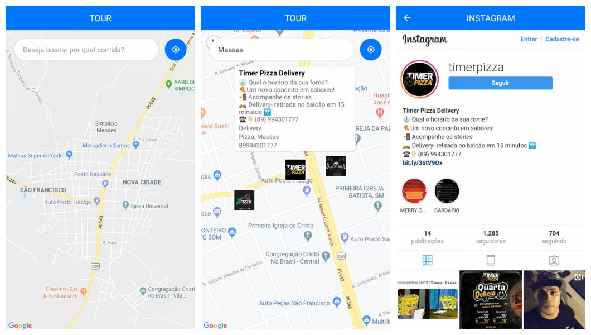

# Semana OmniStack 10.0 da Rocketseat :rocket:
## TOUR- where will we go - MOBILE
Aplicação mobile desenvolvida com auxilio da Rocketseat na 10ª semana omnistack 

## :rocket: Tecnologias usadas
Este projeto foi desenvolvido com as seguintes tecnologias:
- [React Native](https://facebook.github.io/react-native/)
- [Expo](https://expo.io/)

## :computer: Projeto

O TOUR é um projeto que visa conectar lanchonetes, restaurantes e bares com clientes por meio da localidade, em um raio de 20km.

  

## :mortar_board: Quem ministrou?

A semana foi ministrada pelo [Diego Fernandes](https://github.com/diego3g)

## :memo: Licença

Esse projeto está sob a licença MIT. Veja o arquivo [LICENSE](LICENSE) para mais detalhes.

## :muscle: Quem deu aquela força para não desistir?

O pessoal da He4rt Developers e da Rocketseat deram aquela mão quando as coisas ficaram ruins e me salvaram, sem me deixar desistir!
Entrem na [comunidade da He4rt Developers!](https://discord.gg/8mA4CM2) e [na comunidade da Rocketseat :rocket:](https://discordapp.com/invite/gCRAFhc)

---

by João Carli :wave:
